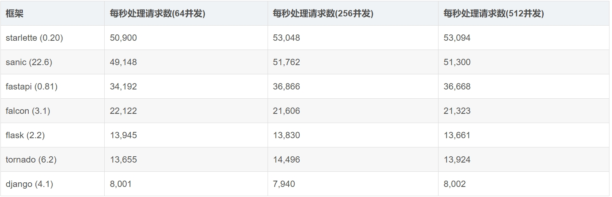
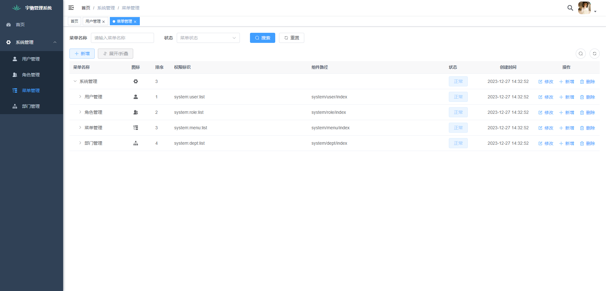
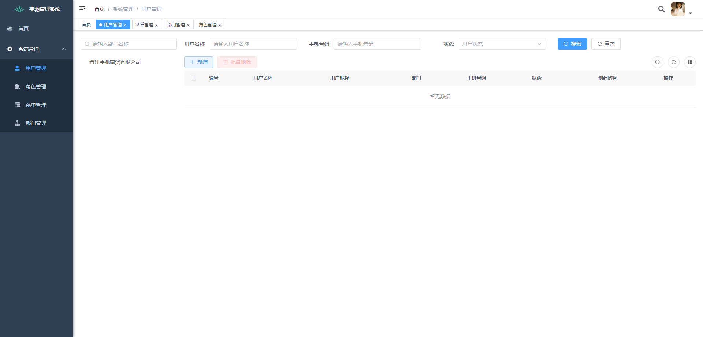
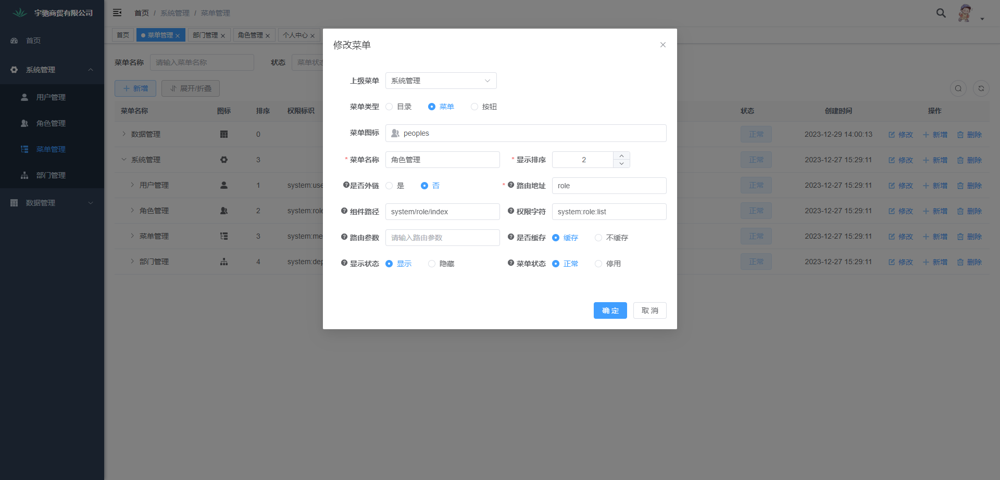
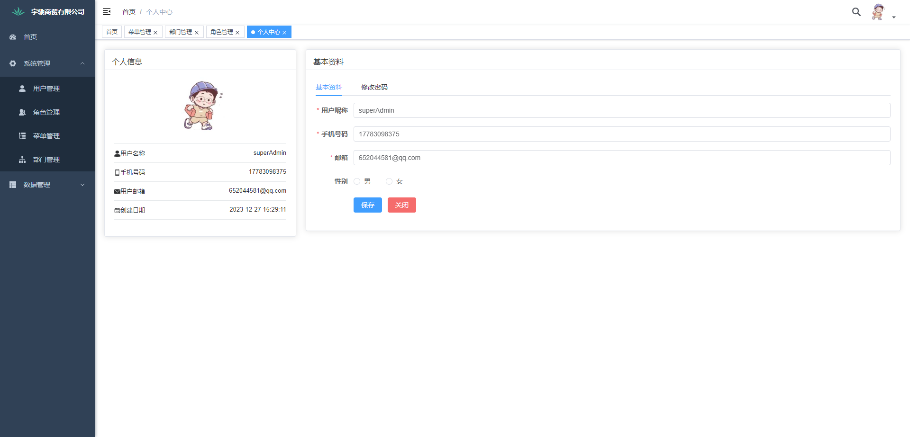

<h1 align="center" style="margin: 30px 0 30px; font-weight: bold;">luban-admin</h1>

<p align="center">
	<a href="https://gitee.com/mengyinggitee/sanic-vue-admin/stargazers"></a>
	<a href="https://gitee.com/mengyinggitee/sanic-vue-admin/members"></a>
	<a></a>
	<a></a>	
	<a></a>
</p>

### 在线体验
演示地址：[http://47.109.25.58:8101/#/login](http://47.109.25.58:8101/#/login)

账号密码：superAdmin/superAdmin


### 项目介绍

若依是一套全部开源的快速开发平台，毫无保留给个人及企业免费使用。[若依框架地址]([Vue3](https://v3.cn.vuejs.org))，
但目前主流的若以框架是基于SpringBoot的java开发语言，企业开发前端常用的是若依框架，而后端没有一个属于python版本的后端，因此萌生了调试一套适合python程序员的快速开发框架，删除广告页面和日常开发者不必要的功能，只保留项目的最核心的配置模块，减少初始化的方式，做到入手既可以开发功能

python主流框架请查看不同的分支（django+mysql，flask+mongo，sanic-mongo）， 其他python框架将持续更新........


### 技术栈介绍

* 前端技术栈： [Vue3](https://v3.cn.vuejs.org) + [Element Plus](https://element-plus.org/zh-CN) + [Vite](https://cn.vitejs.dev)
若依框架版本。
* 后端技术栈： [django](https://www.djangoproject.com/) + [mysql](https://www.mysql.com/) + [redis](https://redis.io/) 实现。

<table>
    <tr>
        <td style="width:400px"></td>
    </tr>
<table>

### 框架能力
* 用户管理：用户是系统操作者，该功能主要完成系统用户配置。
* 部门管理：配置系统组织机构（公司、部门、小组），树结构展现支持数据权限。
* 岗位管理：配置系统用户所属担任职务。
* 菜单管理：配置系统菜单，操作权限，按钮权限标识等。

### 代码优化
* 后端：收集日常的常用方法，增加常用的企业微信机器人通知，数据加解密等常用方法
* 后端：数据库配置增加nacos和本地config的配置的2种配置，多种配置方式
* 后端：配置数据库后，项目启动直接初始化相关数据，不需要导入sql的方式，方便快捷开发进度
* 前端：删除不必要的广告页面，和不必要的功能，比如日志，人员职位，登陆等相关信息，只保留用户，角色，目录，部门核心的模块功能
* 前端：收集封装日常中常用方法，实现工具箱似的开发，开箱即用
* 前端：优化若依框架的部分ui和提取字段，如title，base_path等变为env配置字段和调试时候的vite代理等均有展示

### 前端部署

```
# 本地部署
# 安装依赖(设置镜像源)
yarn --registry=https://registry.npmmirror.com

# 启动服务
yarn run dev

# 打包构建
yarn build:prod

# 前端访问地址 
http://localhost:80

# api地址修改：
vite.config.js文件 server.proxy.target指向后端地址

=======================================================================
# 线上docker部署
# 前提确认宿主机含有node环境，(调试环境) node_version = v21.1.0，
# 安装了yarn 和vite环境
# npm install -g yarn vite

# 安装依赖
yarn --registry=https://registry.npmmirror.com

# 启动服务
yarn run dev

# 打包构建
yarn build:prod

# 前端访问地址 
http://localhost:80

# api地址修改：
.env.production文件  VITE_APP_BASE_API 属性

# 构建命令
sh build.sh
```

### 后端部署

```
本地部署
# 进入目录
cd admin-api

# 安装依赖
pip install -r requirements.txt 

# 配置数据库
/config.py 或者 配置nacos地址 （配置mysql和redis的数据）

# 创建数据库
可以通过数据库管理工具直接手动创建， 也可以运行脚本 python createDatabase.py

# 迁移数据库
python manage.py makemigrations
python manage.py migrate

# 初始化数据
python initDatabase.py

# 启动服务
python mange.py runserver 0.0.0.0:8000

=======================================================================
# docker部署（docker-compose）
docker-compose build && docker-compose up -d

# 或者执行脚本构建(gunicorn部署，已内置调试)
sh build.sh

内置一个超级管理员账号
superAdmin/superAdmin
```


## 演示图

<table>
    <tr>
        <td style="width:400px"></td>
        <td style="width:400px"></td>
    </tr>
    <tr>
        <td style="width:400px"></td>
        <td style="width:400px"></td>
    </tr>
    <tr>
        <td style="width:400px"></td>
        <td style="width:400px"></td>
    </tr>

<table>